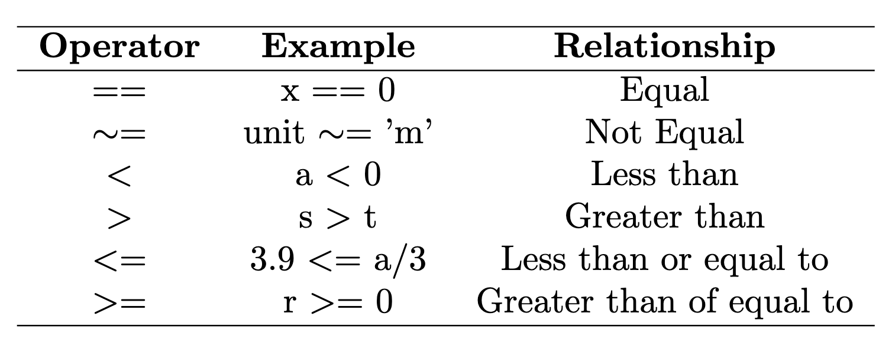

# Structure Programming

Here, we will go over specific examples for each type of structure programming. 

## If Statements

If statements allow you to execute a set of statements if a logical condition is true. First, we need to define operators:

<p align="center">
  
</p>

Let's try an example:

```matlab
x = rand()

if x > 0.5 %You start with if, then condition.
    fprintf('Yes! x is greater than 0.5') %Press enter, and MATLAB will automatically indent, if not press tab.
end % Finally, type in end, and MATLAB will automatically indent backward.
```
Here, we chose the greater than operation. However, we could've used any other logical operation.

```matlab

x = round(rand()) %This will randomly generate 0 or 1

if x >= 0 %You start with if, then condition.
    error('zero value encountered') %Press enter, and MATLAB will automatically indent, if not press tab.
end % Finally, type in end, and MATLAB will automatically indent backward.

% Here, I used the error function, which displays your desired
% error message.
```

## Logical Operators

We can also utilize logical operators in MATLAB, which perform element-wise comparisons. In MATLAB, if a logical condition is true, MATLAB will return the value 1, if it is false it will return the value 0.

<p align="center">
  
</p>

For example:

```matlab

% Generate two random numbers between -1 and 1

a = 2*rand()-1
b = 2*rand()-1

% And Statement

a > 0 & b > 0

% Or Statement

a > 0 | b > 0

% Not Statement 

a ~= b
```

### Logical Expressions

What would happen if we had multiple logical operators in a single expression? How does MATLAB evaluate such an expression?

1. The first thing MATLAB does is evaluate any mathematical expression.
2. Next, MATLAB evaluates all relational expressions/operations.
3. Logical operators are then evaluated in priority order, where ~ has the highest priority, & second, and | has the lowest priority. (~ > & > |).
4. The left-to-right rule applies if you have two operators that are the same in a row.

Let's take the following logical expression and solve it step by step:

```matlab
a * b > 0 & b == 2 & x > 7 | ~(y > 'd')
```
where `a = -1`, `b = 2`, `x = 1` and `y = b`.

For convenience, substitute:

```matlab
-1 * 2 > 0 & 2 == 2 & 1 > 7 | ~( 'b' > 'd' )
```

Now that we have substituted all the numbers and values, we evaluate all mathematical expressions:

```matlab
-2 > 0 & 2 == 2 & 1 > 7 | ~( 'b' > 'd')
```

Now evaluate all relational expressions:

```matlab
-2 > 0
2 == 2
1 > 7
'b' > 'd'
```
This means that we have :

```matlab
F & T & F | ~ F
```

From earlier, `~` has the highest priority. Remember `~` returns the opposite of what you have, therefore `~F --> T`:

```matlab
F & T & F | T
```

Next, evaluate the & operator. Since we have two of them, start from left and proceed right:

Take F & T & F and split it into two segments: 

```matlab
F & T = F
```

Now you have

```matlab
F & F | T
F | T
```

The final answer is `T`. 
