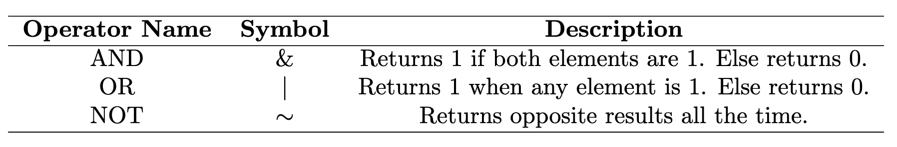

# Structured Programming in MATLAB

In this section, we will go over key examples of structured programming in MATLAB, focusing on control flow structures like `if` statements, logical operators, and `switch` statements. These structures allow us to make decisions and control the flow of our programs.

---

## 1. **If Statements**

`If` statements allow you to execute specific code if a logical condition is true. First, let's look at basic logical operators used in conditions:

<p align="center">
  
</p>

### Example 1: Simple `if` Statement
```matlab
x = rand();  % Random number between 0 and 1

if x > 0.5  % The condition we are checking
    fprintf('Yes! x is greater than 0.5\n');  % Action when the condition is true
end  % End the if statement
```
Here, the condition checks if `x` is greater than 0.5. If true, MATLAB will print the message. Otherwise, it skips the print statement.

### Example 2: Handling Errors with `if`
You can also use `if` to trigger specific actions, such as raising an error:

```matlab
x = round(rand());  % This generates either 0 or 1 randomly

if x == 0  % If x is 0, display an error message
    disp('Zero value encountered');
end  % End the if statement
```

---

## 2. **Logical Operators in MATLAB**

Logical operators allow for element-wise comparisons in MATLAB. If a condition is true, MATLAB returns `1`; if false, it returns `0`.

<p align="center">
  
</p>

### Example 3: Logical Operations
Let’s generate two random numbers between -1 and 1 and apply logical operators:

```matlab
a = 2*rand() - 1;  % Random number between -1 and 1
b = 2*rand() - 1;  % Random number between -1 and 1

% AND statement (checks if both conditions are true)
a > 0 & b > 0

% OR statement (checks if at least one condition is true)
a > 0 | b > 0

% NOT statement (checks if two values are not equal)
a ~= b
```

---

## 3. **Logical Expressions and Operator Precedence**

When using multiple logical operators in a single expression, MATLAB follows a specific order of operations. Here's how it evaluates such expressions:

1. **Mathematical expressions** are evaluated first.
2. **Relational expressions** (e.g., `>`, `==`) are evaluated next.
3. **Logical operators** are evaluated based on priority:
   - `~` (NOT) has the highest priority,
   - `&` (AND) comes next,
   - `|` (OR) has the lowest priority.

If two operators have the same priority, MATLAB evaluates them left to right.

### Example 4: Evaluating a Complex Logical Expression

Given the following expression:
```matlab
a * b > 0 & b == 2 & x > 7 | ~(y > 'd')
```
Where:
```matlab
a = -1;
b = 2;
x = 1;
y = b;  % b is a number, but y will be treated as a character (ASCII value).
```
Step by step, this would evaluate as follows:

1. Substitute the values into the expression:
   ```matlab
   -1 * 2 > 0 & 2 == 2 & 1 > 7 | ~( 'b' > 'd' )
   ```

2. Evaluate the mathematical and relational expressions:
   ```matlab
   -2 > 0 & 2 == 2 & 1 > 7 | ~( 'b' > 'd')
   ```

3. Simplify:
   ```matlab
   F & T & F | ~F
   ```

4. The NOT (`~`) operator takes precedence:
   ```matlab
   F & T & F | T
   ```

5. Evaluate the AND (`&`) from left to right:
   ```matlab
   F & T = F
   ```

6. The expression becomes:
   ```matlab
   F & F | T
   F | T
   ```

Final result: `T` (true).

---

## 4. **If-Else and If-Elseif Statements**

### Example 5: `if...else` Structure
The `if...else` structure allows you to handle two outcomes for a condition:

```matlab
a = rand();  % Random number between 0 and 1

if a > 0.5
    fprintf('a is greater than 0.5\n');
else
    fprintf('a is less than or equal to 0.5\n');
end
```

### Example 6: `if...elseif` Structure
The `if...elseif` structure is used when you have more than two possible conditions:

```matlab
a = randi([0, 3]);  % Random integer between 0 and 3

if a == 0
    fprintf('a is equal to 0\n');
elseif a == 1
    fprintf('a is equal to 1\n');
elseif a == 2
    fprintf('a is equal to 2\n');
else
    fprintf('a is equal to 3\n');
end
```

---

## 5. **Switch Statements**

The `switch` structure is another control flow tool that evaluates a single expression and chooses between multiple cases based on the value of that expression.

### Example 7: Switch Statement
In this example, we map numbers to words:

```matlab
number = randi([0, 3]);  % Random integer between 0 and 3

switch number  % Switch structure starts here
    case 0
        disp('Zero!');
    case 1
        disp('One!');
    case 2
        disp('Two!');
    otherwise
        disp('Three!');
end
```

In this case, the `switch` statement checks the value of `number` and displays the corresponding text. If `number` is not 0, 1, or 2, the `otherwise` block handles all other cases.

---

### Summary:
- `If` statements check a condition and execute code accordingly.
- Logical operators (`&`, `|`, `~`) allow for combining multiple conditions.
- Operator precedence determines how complex expressions are evaluated.
- The `if...elseif` structure allows handling multiple conditions.
- `Switch` statements are useful for matching a single variable against multiple cases.
